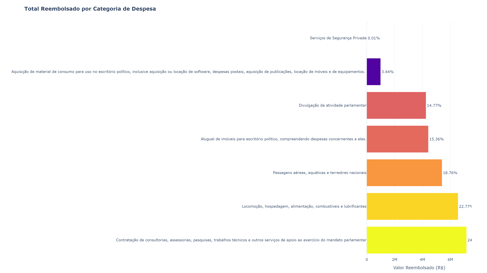
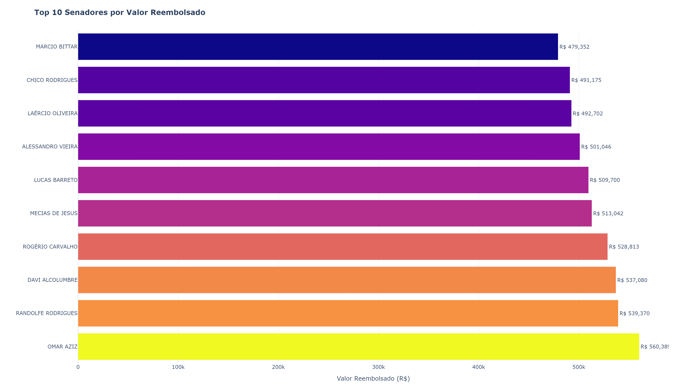
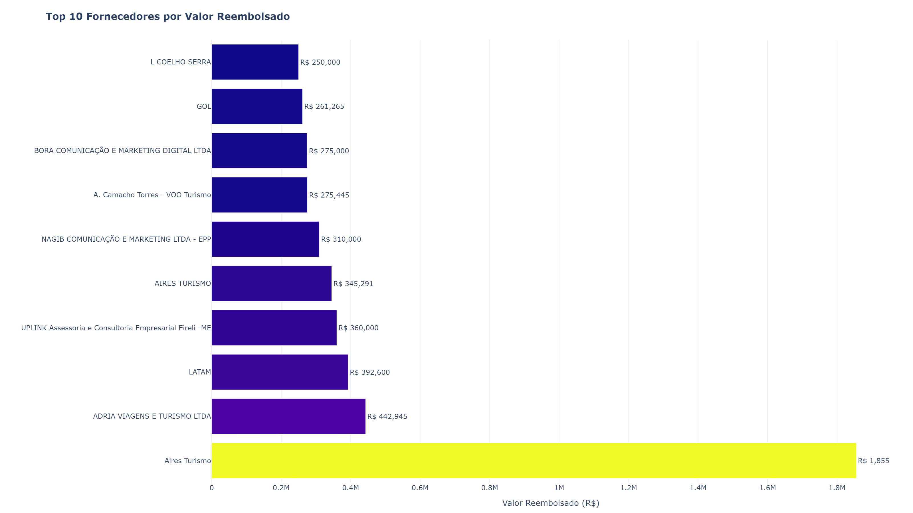
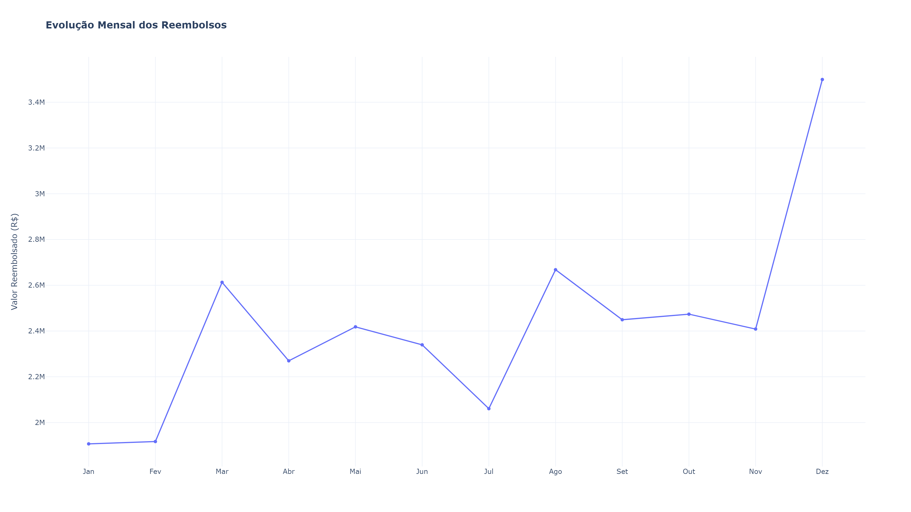
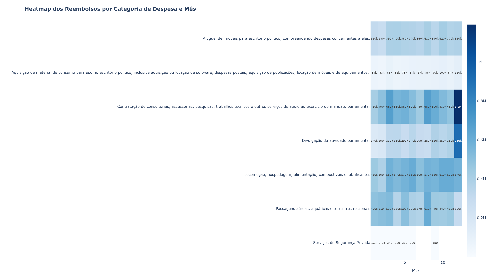

# 📊 Análise dos Reembolsos da CEAPS – Exercício 2023

> **Status do Projeto:** ✅ Concluído

Projeto de Ciência de Dados desenvolvido em Python com o objetivo de realizar uma Análise Exploratória de Dados (EDA) dos reembolsos efetuados pela **Cota para o Exercício da Atividade Parlamentar dos Senadores (CEAPS)** referentes ao exercício de **2023**.

O trabalho contempla desde a preparação e limpeza dos dados até a construção de indicadores, visualizações interativas e um dashboard executivo, permitindo compreender como os recursos públicos foram distribuídos entre categorias de despesas, parlamentares e fornecedores.

---

# Objetivos

- Realizar a limpeza e preparação dos dados.
- Construir indicadores executivos (KPIs).
- Identificar as principais categorias de despesas.
- Analisar os senadores com maiores valores reembolsados.
- Identificar os principais fornecedores.
- Avaliar a evolução mensal dos gastos.
- Construir um Dashboard Executivo.
- Documentar todas as etapas da análise.

---

# Tecnologias Utilizadas

- Python
- Pandas
- NumPy
- Plotly
- Jupyter Notebook

---

# Estrutura do Projeto

```
CEAPS_2023/

├── Análise_CEAPS_2023.ipynb
├── Análise_CEAPS_2023.html
├── README.md
│
└── images/
    ├── categorias.png
    ├── senadores.png
    ├── fornecedores.png
    ├── mensal.png
    └── heatmap.png
     
```

---

# Principais Indicadores

Durante o desenvolvimento do projeto foram construídos indicadores como:

- Valor total reembolsado
- Quantidade de despesas
- Número de senadores
- Número de fornecedores
- Ticket médio
- Categoria com maior participação
- Senador com maior volume de reembolsos
- Fornecedor com maior volume de pagamentos

---

# Visualizações

## Categorias de Despesas



---

## Top 10 Senadores



---

## Top 10 Fornecedores



---

## Evolução Mensal



---

## Heatmap das Categorias



---


# Principais Resultados

- Os reembolsos concentraram-se em um número reduzido de categorias de despesas.
- As despesas relacionadas ao funcionamento dos gabinetes representaram a maior parcela dos recursos utilizados.
- Foi possível identificar padrões de concentração entre fornecedores e parlamentares.
- A evolução mensal apresentou comportamento consistente ao longo do exercício.
- O dashboard executivo consolidou todos os principais indicadores em uma única visualização.

---

# Conclusão

O projeto permitiu compreender a distribuição dos recursos da CEAPS durante o exercício de 2023 por meio de técnicas de Análise Exploratória de Dados (EDA), indicadores executivos e visualizações interativas.

Além de documentar todo o processo analítico, este notebook estabelece uma metodologia padronizada para análises futuras da série histórica da CEAPS.

"Este projeto integra uma série de estudos sobre a execução da CEAPS entre 2021 e 2024, desenvolvida com metodologia padronizada para permitir análises comparativas entre diferentes exercícios."

---

# Próximos Passos

- Desenvolver a análise referente ao exercício de 2024.
- Consolidar uma análise comparativa entre os anos de 2021, 2022, 2023 e 2024.
- Ampliar o dashboard com indicadores comparativos entre exercícios.
- Explorar análises estatísticas e temporais da evolução dos reembolsos.

---

# Fonte dos Dados

Os dados utilizados neste projeto são públicos e foram obtidos no portal de Dados Abertos do Senado Federal.

---

# Autor

**Claudio Amaro da Silva**

Projeto desenvolvido para compor o portfólio em Ciência de Dados, com foco em Análise Exploratória de Dados (EDA), visualização de informações e desenvolvimento de dashboards utilizando Python.
